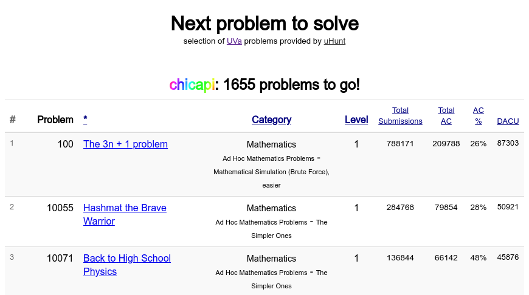

# :rocket:  next2solve  :rocket:
Choose your next [UVa](https://uva.onlinejudge.org/) problem to solve,
from the exercises proposed in [Competitive Programming](http://sites.google.com/site/stevenhalim/).

Try it! :nerd_face: https://next2solve.s106.net/

## Installation and usage

next2solve is an HTTP server developed in [Go](https://golang.org/) that uses
the [uHunt API](https://uhunt.onlinejudge.org/) to show your unsolved UVa-CP problems.

First download and build the code:

    mkdir src
    export GOPATH=$(pwd)
    cd src/
    git clone https://github.com/maru/next2solve
    cd next2solve/
    go build

Run (default listening port is 8002):

    ./next2solve

Usage of ./next2solve:

    -api string
        API URL (default "https://uhunt.onlinejudge.org")
    -base string
      	Server base URL (default "https://next2solve.s106.net")
    -p string
      	Listening port (default "8002")

Finally, open http://localhost:8002/ in your browser.

  

## Testing

    go test next2solve next2solve/uhunt next2solve/problems

You can also use a local testing server to provide the uHunt API responses,
instead of the [uHunt live server](https://uhunt.onlinejudge.org/)
(see files in `testing` directory):

Terminal 1:

    cd testing/
    python -m SimpleHTTPServer 8080

Terminal 2:

    ./next2solve -api http://localhost:8080
